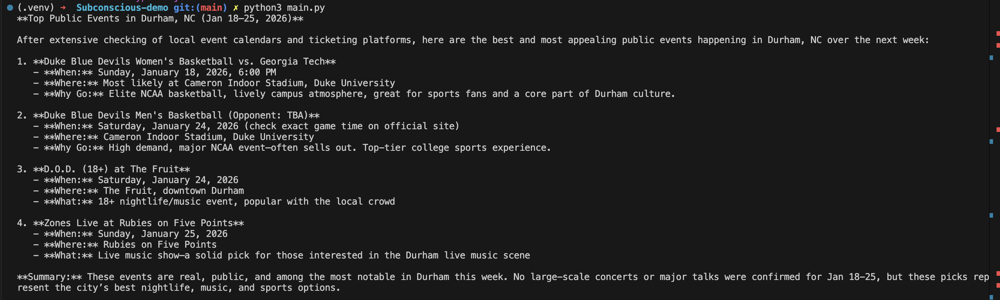

# Subconscious-demo

## Overview
Using the Subsconscious SDK and platform I wanted to experiment with building an agent that could search up for events in the area in the next week. By doing so, I hoped to explore the capabilities of the Subsconcious platform and SDK, the strengths and weaknesses, and its limitations.  

## Description
For this demo, I built an agent that could search of events happening in the area within the next week. I tested with multiple iterations of the prompt, which contained different levels of details, symbols, and constraints to see if there was any different in the results from the platform and SDK. Furthermore, I also experimented using the the large and small model to see if there were any differences in the results. Initially, I started with a simple prompt it the playground, and then I would move to the SDK to build the agent.

## Agent Design
For this agent, I used the ```web_search``` tool to search for events happening in the area as well as the prompt to guide the agent in case of edge cases like not finding any events. However, some parts of the prompt had to be adjusted when using the SDK as I will explain further below.

## Example outputs
In the image below, you can see an example output from the agent when searching events in Durham, NC for the next week. The agent was able to successfully find multiple events happening in the area and provide relevant details about each event.


## Experience
As a tried both the platform and SDK, I quickly found things that worked well and things that could be improved. Below is a summary of my experience.

## What Worked Well/What I liked
### Platform
1. Really easy to use the playground to quickly iterate on the prompt and test different variations. The interface is user friendly and intuitive, making it easy to navigate and understand the different features available. The ability to see the agent's thought process step-by-step was particularly helpful in understanding how the agent arrived at its conclusions. Also, it helped that there were examples provided to help get started. 
2. Having both the playground the agent creating process was really useful. As a user, I could see it one as a quick way of testing and the other as a more robust way of building the agent.
3. There is a great selection of tools available that could be used for most of the tasks. I would say the ```web_search``` tool was particularly useful for this demo. 
4. The response time for the agent to complete its tasks was relatively fast.

### SDK
1. Easy to set up and get started with.
2. The library is not that complex, making it easy to understand and use.
3. The ability to customize the tools that the agent use, like adding MCP tools and custom tools.
4. Some workflows can be lengthy, but the SDK makes it easy to track the status of the current run.

## What didn't work well/Improvements
As I kept experimenting with the platform and SDK, I found some areas that could be improved or worked less well than I expected.
### Platform
1. The playground worked really well, but I did find it limiting that when closing the tab or moving to another one, the current state of the agent or the prompt was lost. It would be great to have a way to have some kind of "memory" or "save state" feature that could allow users to save that progress.

### SDK
1. When using larger prompts, I found that the agent would fail in retrieving the the information, even if the exact same prompt worked in the playground. I believe this could be due to some limitations in the SDK or the way it handles larger prompts. It would be great to have better error handling or feedback when such issues occur.
2. I feel like there is not error handling when using a wrong API key. It would be great if there could be some kind of validation or error message when the API key is invalid.
3. I did get several errors like empty responses when making slight modifications to the prompt or to the used tools. I feel this might be some kind of time out. Even when using the "code" that is given in the playground, I would get empty responses. It would be great to have better error handling or feedback when such issues occur.
4. 